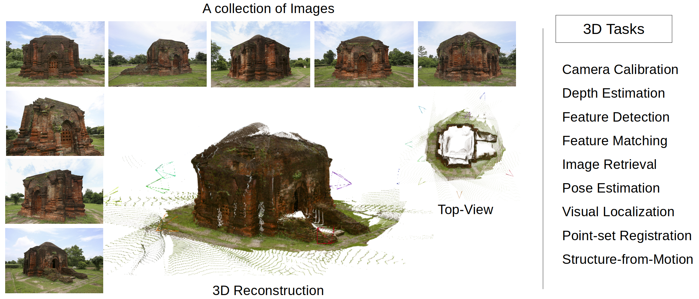
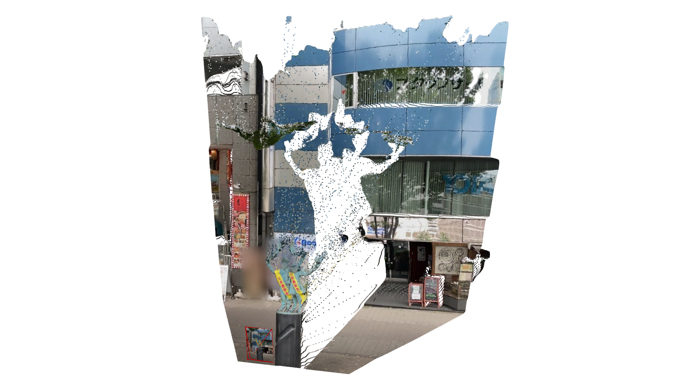
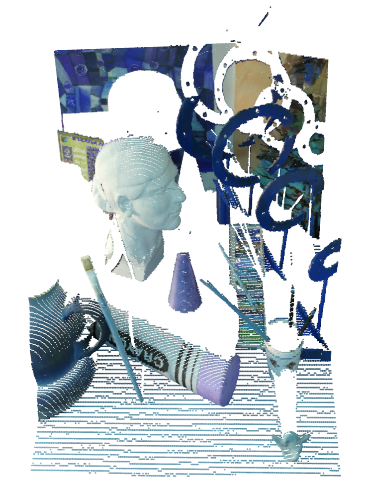
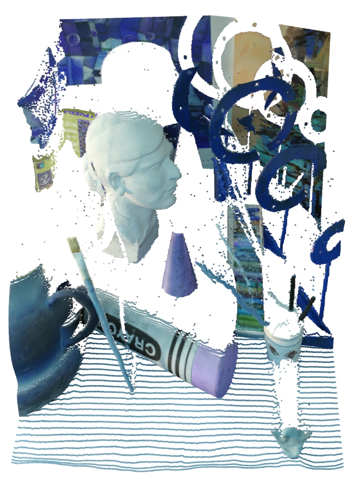
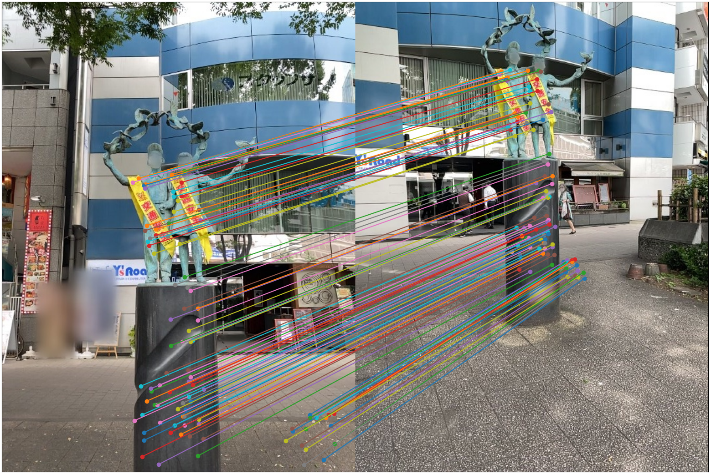
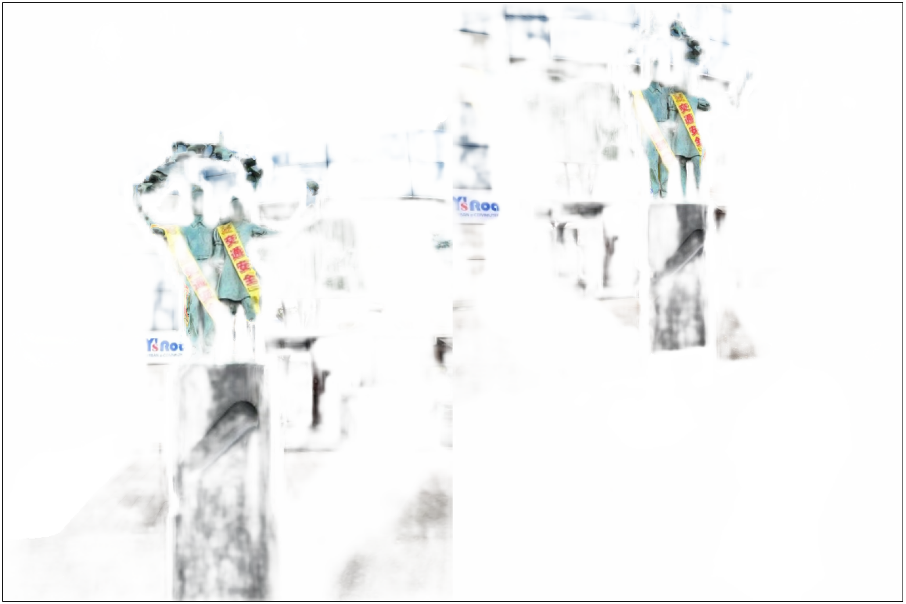
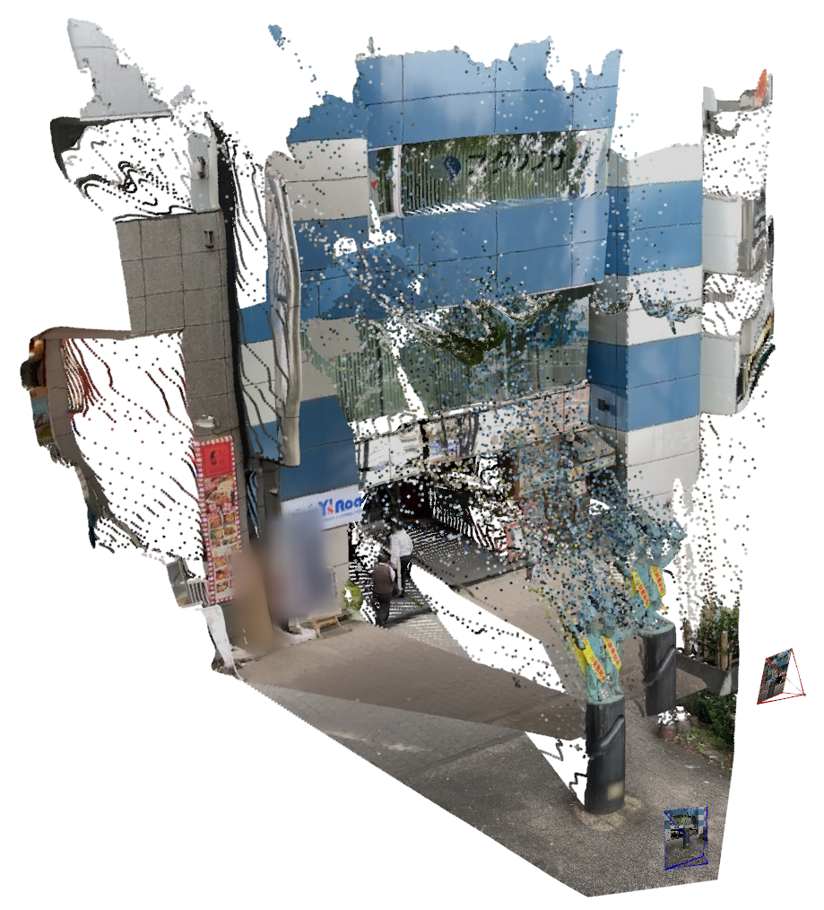
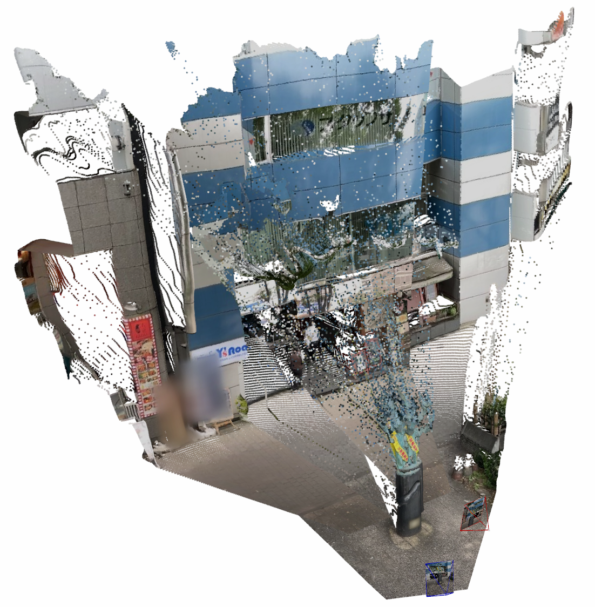
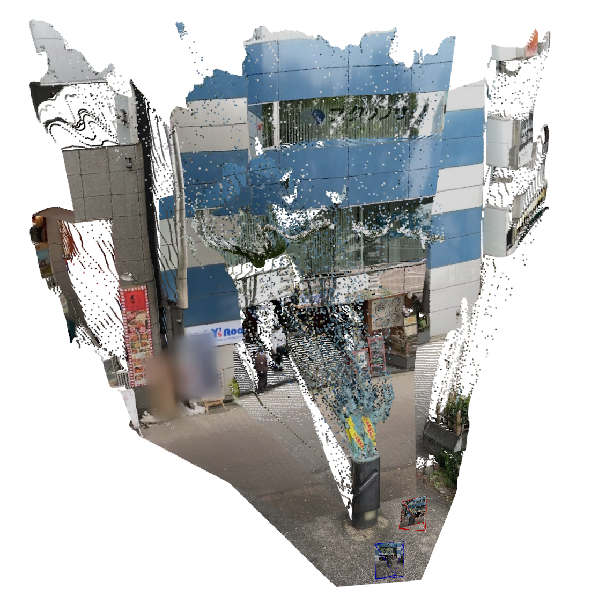

# Python Only 3D Computer Vision



## Supported Features

- [x] [Focal Length Estimation](#monocular-depth-estimation) (Metadata, DepthPro, MoGe, GeoCalib)
- [ ] Camera Calibration
- [ ] Multi-Camera Calibration
- [ ] PTZ-Camera Calibration
- [x] [Monocular Depth Estimation](#monocular-depth-estimation) (DepthPro, MoGe)
- [x] [Stereo Depth Estimation](#stereo-depth-estimation) (FoundationStereo)
- [ ] Global Image Retrieval (NetVLAD, SALAD)
- [x] [Local Feature Detection and Matching](#local-feature-detection-and-matching) (LoFTR, RoMa)
- [x] [Relative Pose Estimation](#pose-estimation-relativeabsolute) (Essential, Fundamental, Homography)
- [x] [Absolute Pose Estimation](#pose-estimation-relativeabsolute) (PnP)
- [x] [Visual Localization](#pose-estimation-relativeabsolute) (PnP)
- [x] [Point Cloud Registration](#point-cloud-registration) (Procrustes, ICP)
- [ ] Triangulation
- [ ] Bundle Adjustment
- [ ] Differentiable Bundle Adjustment
- [ ] Structure-from-Motion (Incremental, Global)
- [ ] Joint Optimization of Pose and NeRF/GS (iNeRF, iCoMa)
- [ ] Mesh Reconstruction (SDF, Marching Cubes, PSR)
- [ ] Voxelization
- [ ] 3D Representations (Point Cloud, Voxels, Mesh, NeRF, GS)
- [ ] Geo-registration
- [ ] MonoDepth Scale Ambiguity
- [ ] Video Depth Alignment
- [ ] Point Cloud Completion

> WARNING: Some features or methods may be missing for now. They will be implemented slowly. The codebase may have significant changes.

A lot of 3D computer vision tasks will be supported with a simple inference script with SOTA models.
However, the following tasks will not be supported:
* Object-Level 3D Tasks (Classification, Detection, Segmentation)
* Scene Flow & Motion (Optical Flow) 
* Learning-assisted SfM (DUSt3R, MASt3R, VGGSfM, etc.)
* Visual SLAM (may be later)
* Absolute Pose Regression
* Scene Coordinate Regression


## Installation

```bash
bash install.sh
```

## Monocular Depth Estimation

The goal is to get the pixel-wise depth values (and bonus: focal length).

Supported Metric-Depth Models:
* [DepthPro](https://github.com/apple/ml-depth-pro) (ArXiv 2024)

Supported Relative-Depth Models:
* [MoGe](https://github.com/microsoft/moge) (CVPR 2025)


Run this command to get the estimated depth and focal length (if not exist in metadata):

```bash
python scripts/estimate_depth.py
```

> Notes: For outdoor images, mask the sky.

## Stereo Depth Estimation

The goal is to get the pixel-wise depth values given stereo images.
Usually the depth values are in metric-scale and accurate compared to monocular depth methods.

Supported Models:
* [FoundationStereo](https://github.com/NVlabs/FoundationStereo) (CVPR 2025 Oral)

> Notes: For FoundationStereo, download the pre-trained model from official repo and put them in checkpoints/ folder.

Run this command to get the estimated depth for the left image:

```bash
python scripts/estimate_stereo_depth.py
```
Ground-truth                |  Estimated
:-------------------------:|:-------------------------:
  |  


## Global Image Retrieval

The goal is to search for the most similar image from a database with respect to the given image.

Supported Models:


## Local Feature Detection and Matching

Given two images, to find the matches (pixel locations) based on features correspondences.

Supported Feature Detectors/Matching Models:
* [LoFTR](https://github.com/zju3dv/LoFTR) (CVPR 2021)
* [RoMa](https://github.com/Parskatt/RoMa) (CVPR 2024)

Run this command to match the two images:

```bash
python scripts/match_views.py
```

Matched Keypoints             |  Matched 3D Effect
:-------------------------:|:-------------------------:
  |  

> Notes: You can also specify the number of matches for dense methods.

## Pose Estimation (Relative/Absolute)

Given 2D correspondences, to find the relative or absolute pose between two images.

Relative Pose Estimation
* Up to an unknown scale
* 2D-2D Correspondences
* Pose relative to an another image

Absolute Pose Estimation or Camera Relocalization
* Up to a real scale
* 2D-3D Correspondences
* Pose relative to a world/map

> With relative pose from 2D-2D correspondences, you can only recover the direction of motion (translation vector is only correct up to scale), but not how far you moved. So the resulting pose is in an arbitary scale.

Pose Solvers:
* 2D-2D Correspondences
  * Essential Matrix (if you know the camera intrinsics)
  * Fundamental Matrix (if you don't know the camera intrinsics)
  * Homography
* 2D-3D Correspondences
  * PnP (if you know the camera intrinsics and depth of the first image)
* 3D-3D Corrspondences
  * Procrustes (if you know the camera intrinsics and depth of both images)

No matter which algorithm you choose, the initial correspondences will be pixel correspondences.

Run this command to match the two images:

```bash
python scripts/find_pose.py
```

Relative Pose Estimation   |  Absolute Pose Estimation
:-------------------------:|:-------------------------:
  |  

<!-- > Here you can see that in relative pose estimation, the reconstructed point clouds are not aligned. -->


## Point Cloud Registration

Given two point clouds, find the transformation and align them.

Global Registration:
* Procrustes or Kabsch

Local Registration:
* ICP

Feature-based Registration:
* [Deep Gloabl Registration](https://github.com/chrischoy/DeepGlobalRegistration) (CVPR 2020 Oral)

Run this command to align the point clouds:

```bash
python scripts/align_pcd.py
```

Gloabl Registration   |  Local Registration
:-------------------------:|:-------------------------:
  |  

> Before registration/alignment, the two point clouds are in their own coordinate system.


<!-- 
## Testing Datasets

Download the testing datasets from [here](https://colmap.github.io/datasets.html#datasets).

Name | #images | Intrinsics | Lens
--- | --- | --- | ---
Gerrard Hall | 100 | Same | Wide-angle
Graham Hall | 1273 | Same | Wide-angle
Person Hall | 330 | Same | Wide-angle
South Building | 128 | Same | -

## Two-View

### Global Matching

### Local Matching


### Relative Pose Estimation


### Absolute Pose Estimation

## More Views

### Structure-from-Motion

### Visual Localization


## Image Matching

* SIFT
* LoFTR

## Image Retrieval

* R2Former
* CosPlace
* NetVLAD
* SALAD


## Depth Estimation


## Structure-from-Motion

* COLMAP
* Detector-free SfM
* GLOMAP

### Structure

Usually, structure is a scene represention, that is implicit (defined with a neural network) or explicit (3D model that can be visualized directly, e.g. point cloud, meshes).
The structure can be recovered by
1. SfM approaches (unknown scale, correspondences between multiple images)
2. Scene Coordinate Regression (absolute or relative scale, directly estimate 3D points in scene space with a neural network)
3. LiDAR scanners (absolute scale, point clouds)

The goal is to get the 3D representation of the scene that may or may not have the absolute scale.

### Motion

Usually, motion is represented by:
1. Unstructured collection of images (no order, randomly captured with different cameras)
2. Sequences of images or Video (ordered images, sequentially captured with a single camera)

The goal is to estimate the pose (position + orientation) of the images relative to a scene's origin.

SfM is the task of recovering the scene structure from sufficient number of captured images.


## Absolute/Relative Pose Regression

Represent the scene with an implicit NN, which is trained end-to-end.
At test time, regress an absolute or relative pose from a query image.

Limitations of APR methods:
* w/o geometric constraints, they do not generalize well to novel viewpoints or appearances.
* They do not scale well when limiting network capacity. 

Limitations of RPR methods:
* These methods regress a camera pose relative to one or more database images. While being scene-agnostic, they are often limited in accuracy.


## Scene Coordinate Regression

Represents the scene within the weights of a NN.
Regresses corresponding 3D scene coordinates for all pixels in the query image.
First predict 2D-3D correspondences and then solve for the pose with PnP-RANSAC.
Usually, the network is supervised with ground truth 3D scene coordinates, (from a depth sensor or an SfM point cloud).
But recent works train w/o ground truth scene coordinates using a reprojection loss with ground truth poses and calibration parameters.

Limitations:
* Limited on small-scale scenes.


## Visual Localization or Re-localization


## Visual Odometry

## SLAM

## 3D Reconstruction -->


## References

* https://github.com/colmap/colmap
* https://github.com/naver/dust3r
* https://github.com/apple/ml-depth-pro
* https://github.com/microsoft/moge
